

---

## Reviewer 9qHM — W2 / Q1: Optimizer-regime evidence beyond PINNs

> *"The optimizer analysis is much more developed for PINNs than for FNOs or NeuralODEs … Can you add stronger evidence beyond PINNs for the optimizer-regime conclusions?"*

---

**Figure 1. Physics-Informed NeuralODE, RoPINN, and NNCG in NeuralODE**

*Hyperparameter-sweep heatmaps (learning rate × architecture scale) for three optimizer variants on a NeuralODE benchmark. Each cell encodes the final training loss (left column) or relative test error (right column) of a single run. Comparing rows (a)–(b), (c)–(d), and (e)–(f) directly reveals how the well-trained / underfitting / overfitting regime structure shifts when moving from the vanilla physics-informed baseline (PI-NeuralODE) to curvature-aware methods (RoPINN, NNCG), providing optimizer-regime evidence on a non-PINN SciML model. Note the increased fragmentation in the NNCG heatmaps (e)–(f), consistent with the instability discussed in W3.*

<table border="0" cellpadding="0" cellspacing="0" align="center" style="border-collapse: collapse;">
  <tr>
    <td align="center" style="padding: 10px; border: 0px;">
      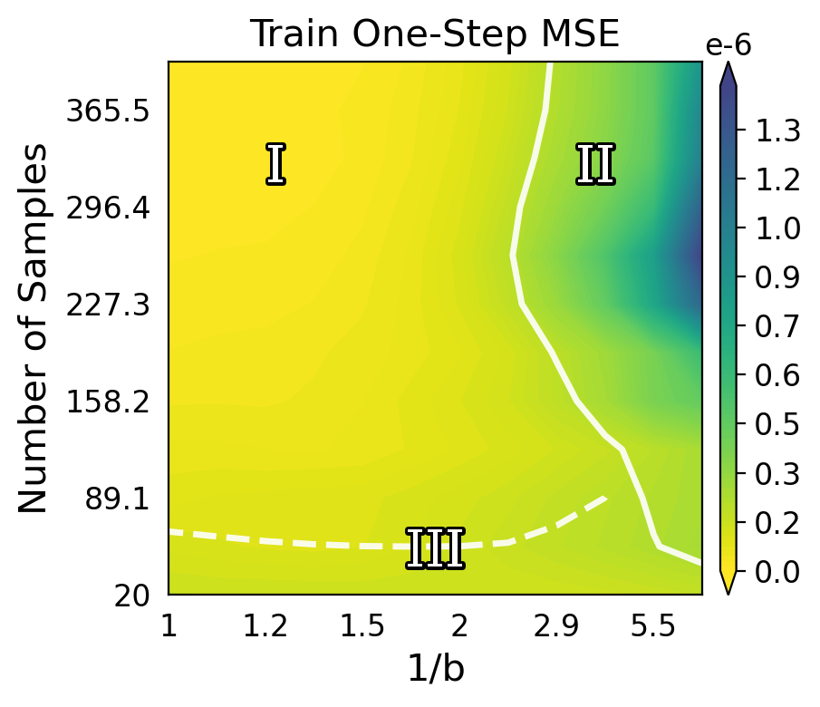
       
      <strong>(a) PI-NeuralODE Training Loss</strong>
    </td>
    <td align="center" style="padding: 10px; border: 0px;">
      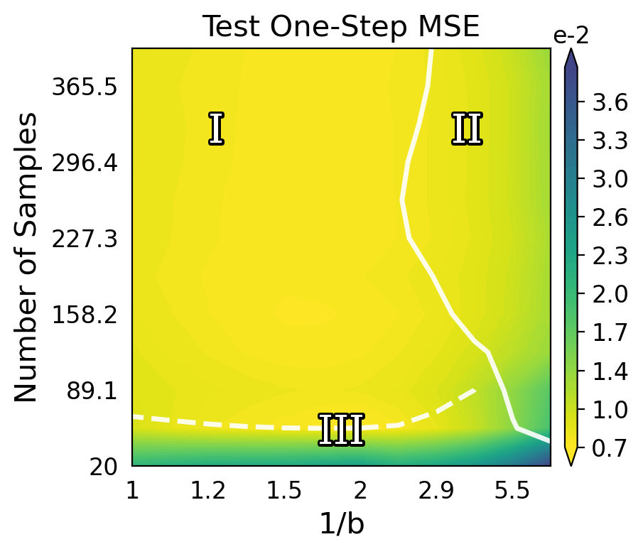
       
      <strong>(b) PI-NeuralODE Test Error</strong>
    </td>
  </tr>
  <tr>
    <td align="center" style="padding: 10px; border: 0px;">
      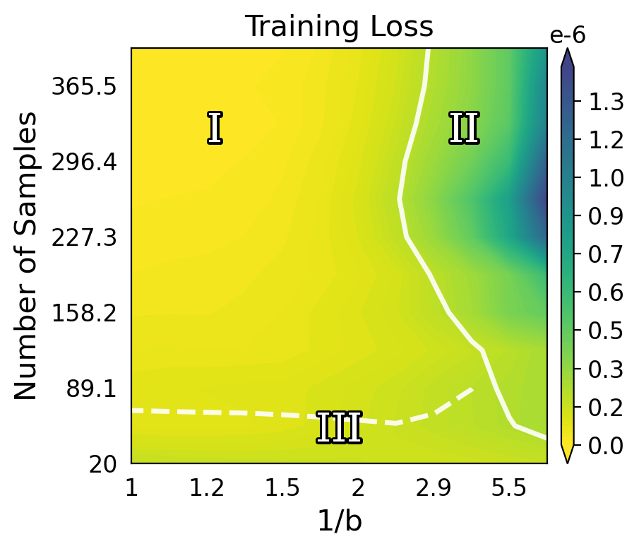
       
      <strong>(c) RoPINN Training Loss</strong>
    </td>
    <td align="center" style="padding: 10px; border: 0px;">
      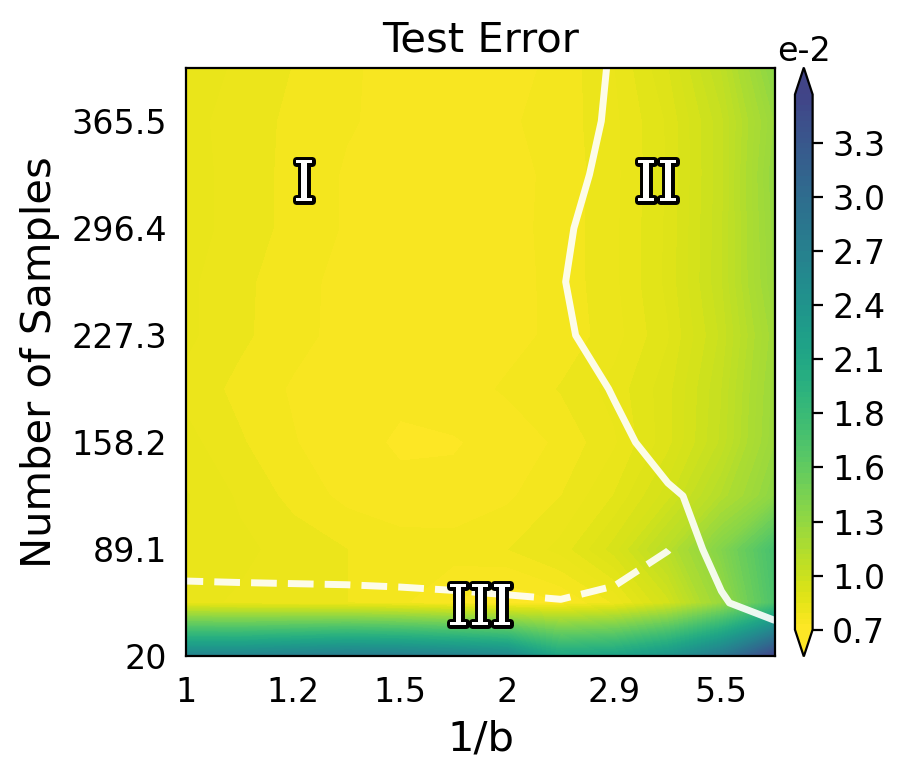
       
      <strong>(d) RoPINN Test Error</strong>
    </td>
  </tr>
  <tr>
    <td align="center" style="padding: 10px; border: 0px;">
      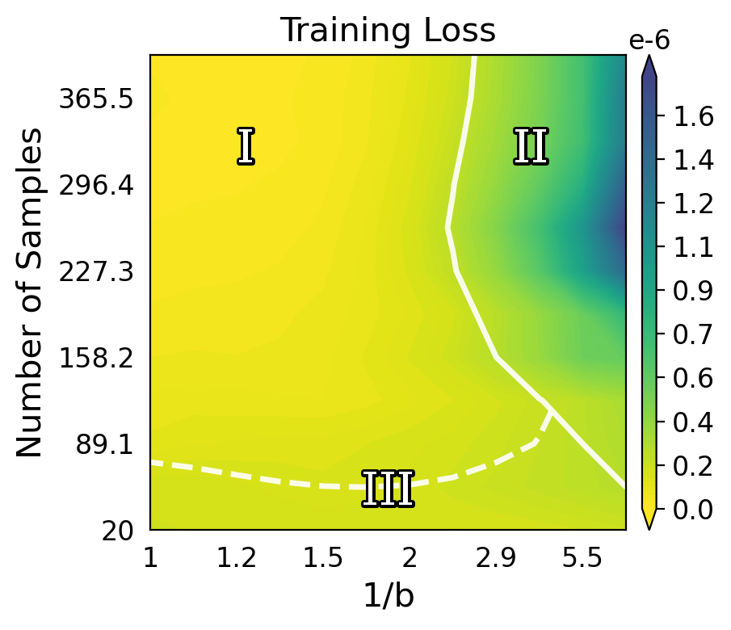
       
      <strong>(e) NNCG Training Loss</strong>
    </td>
    <td align="center" style="padding: 10px; border: 0px;">
      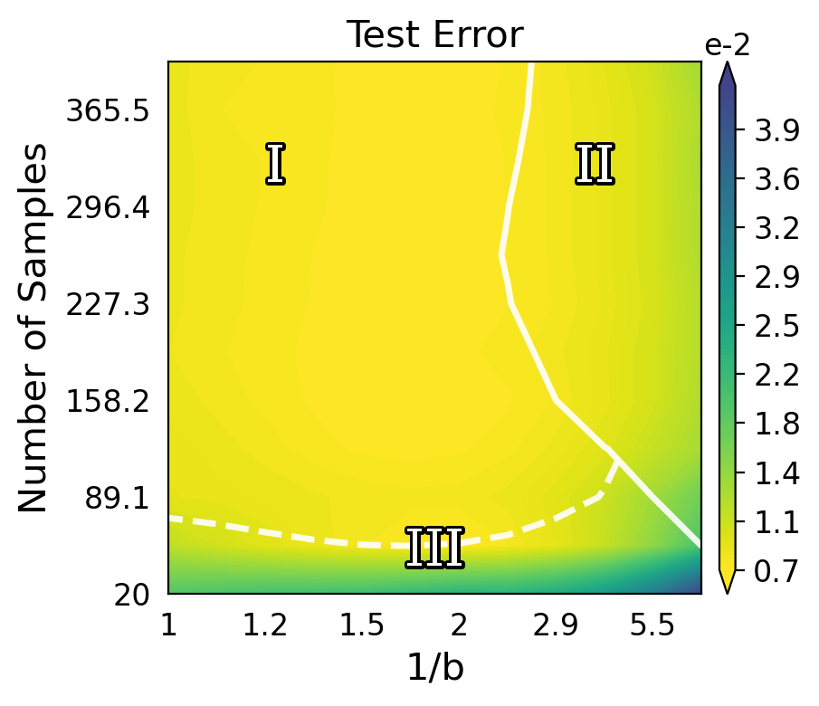
       
      <strong>(f) NNCG Test Error</strong>
    </td>
  </tr>
</table>

---

**Figure 2. ALM, RoPINN, and Curriculum Learning in PINO**

*Regime-distribution results for three optimization strategies applied to a Physics-Informed Neural Operator (PINO / FNO) benchmark. ALM enforces physics constraints via an augmented Lagrangian penalty; RoPINN reweights PDE residual terms; curriculum learning gradually increases PDE complexity during training. The panel shows how each strategy shifts the proportion of runs falling into each regime, demonstrating regime-specific optimizer effectiveness on an FNO model — extending the optimizer-regime analysis beyond the PINN setting.*

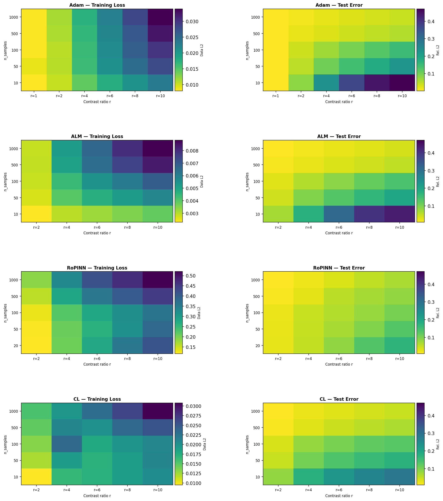

---

## Reviewer 9qHM — Q3 / Reviewer oZBm: Regime boundary sensitivity

> *9qHM Q3: "How robust is the three-regime taxonomy to the exact way the boundaries are defined?"*
> *oZBm: "How sensitive are the regime boundaries to these threshold choices? … demonstrating such robustness would strengthen the claim that the regimes represent meaningful structural behavior rather than an artifact of the chosen thresholds."*

---

**Figure 3. Regime Boundary Sensitivity — Overlay Plots**

*Each panel overlays multiple regime boundary contours drawn at different threshold values on the same hyperparameter-sweep heatmap, visualizing how much the well-trained / underfitting / overfitting boundaries shift as the threshold changes. Eight settings are shown: five PINN variants (Convection with ALM, L-BFGS, NNCG, RoPINN; Reaction with L-BFGS; Wave with L-BFGS) and two neural operator settings (AD-FNO, Poisson-FNO). The substantial overlap of contours across all panels indicates that the regime structure is stable under reasonable threshold perturbations, directly rebutting the concern that regimes are an artifact of a single arbitrary cutoff.*

<table border="0" cellpadding="0" cellspacing="0" align="center" style="border-collapse: collapse;">
  <tr>
    <td align="center" style="padding: 10px; border: 0px;">
      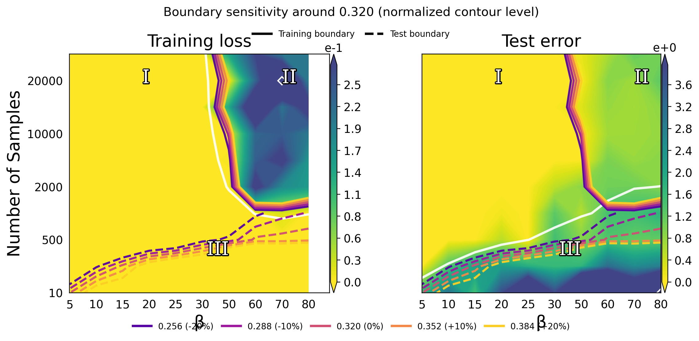
       
      <strong>(a) Convection + ALM</strong>
    </td>
    <td align="center" style="padding: 10px; border: 0px;">
      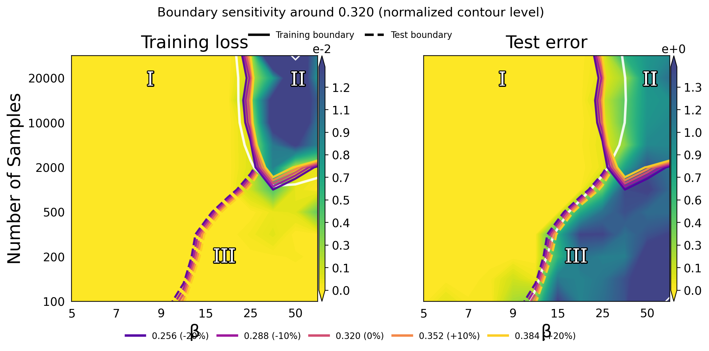
       
      <strong>(b) Convection + L-BFGS</strong>
    </td>
  </tr>
  <tr>
    <td align="center" style="padding: 10px; border: 0px;">
      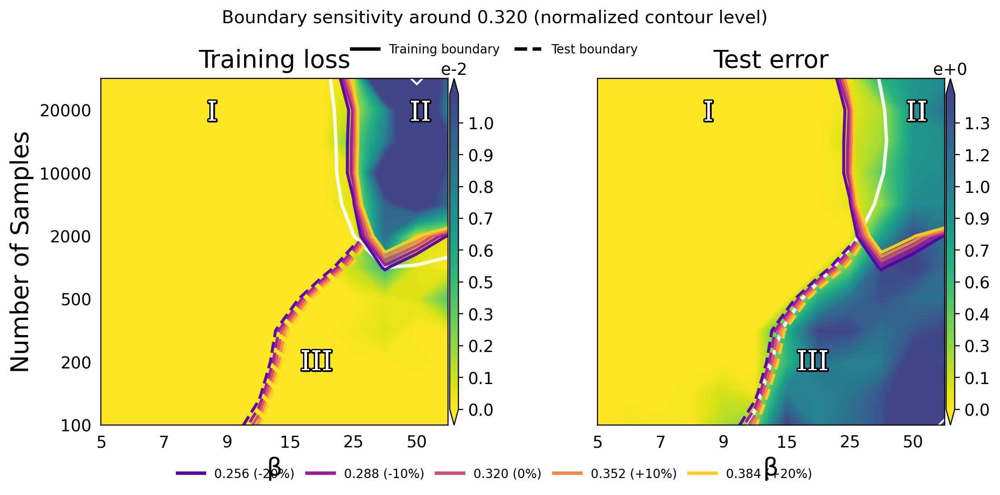
       
      <strong>(c) Convection + NNCG</strong>
    </td>
    <td align="center" style="padding: 10px; border: 0px;">
      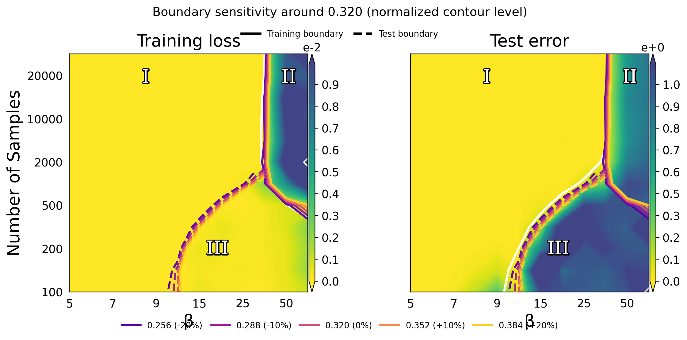
       
      <strong>(d) RoPINN</strong>
    </td>
  </tr>
  <tr>
    <td align="center" style="padding: 10px; border: 0px;">
      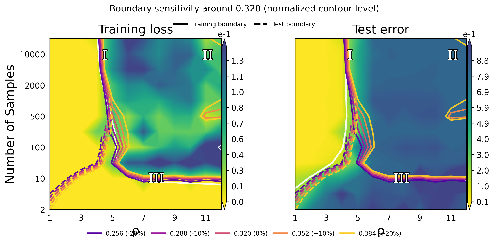
       
      <strong>(e) Reaction + L-BFGS</strong>
    </td>
    <td align="center" style="padding: 10px; border: 0px;">
      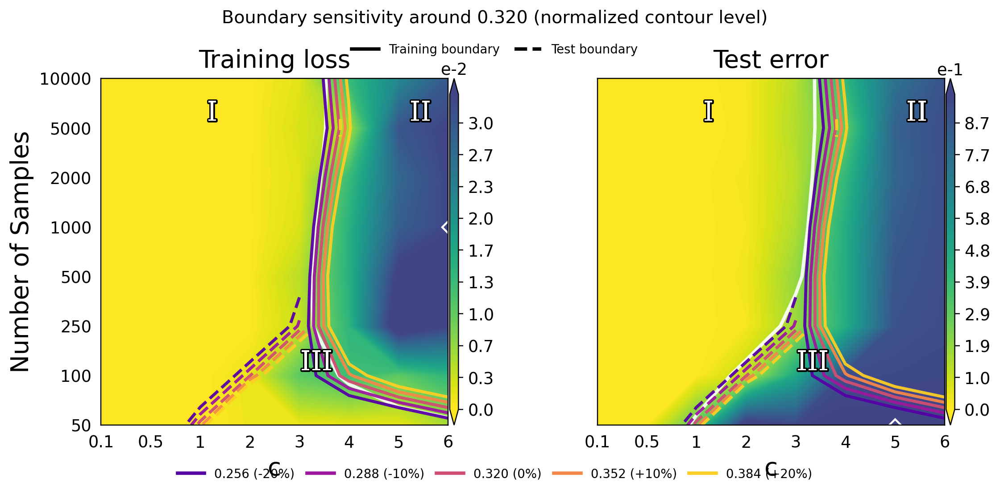
       
      <strong>(f) Wave + L-BFGS</strong>
    </td>
  </tr>
  <tr>
    <td align="center" style="padding: 10px; border: 0px;">
      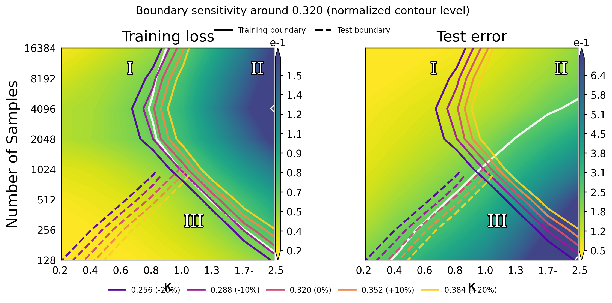
       
      <strong>(g) AD-FNO</strong>
    </td>
    <td align="center" style="padding: 10px; border: 0px;">
      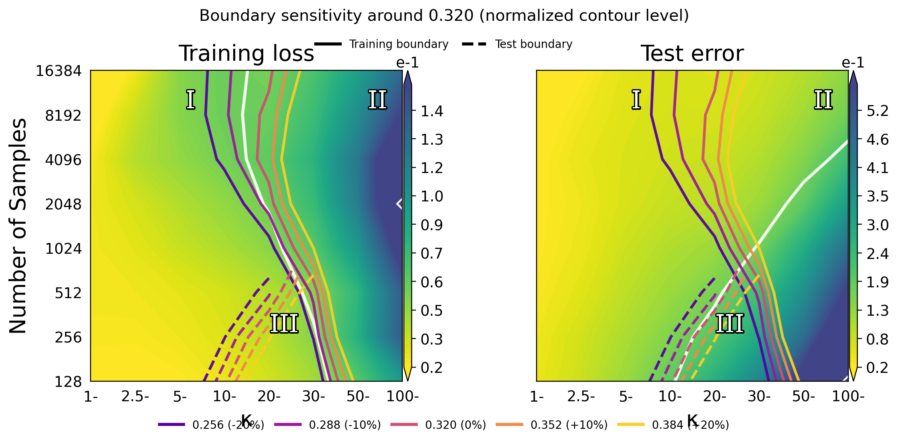
       
      <strong>(h) Poisson-FNO</strong>
    </td>
  </tr>
</table>

---

## Reviewer sQNm — Q1: Effect of collocation resampling in PINNs

> *"How does re-sampling collocation points at every iteration change the conclusions? That would correspond to the limit as the y-axis goes to infinity in the plots shown in Figure 2."*

---

**Figure 4. Collocation Resampling in PINNs**

*Training dynamics under collocation resampling, where new collocation points are drawn at every iteration rather than fixed at the start of training. This corresponds to the infinite-data limit along the collocation-size axis. The figure shows how resampling affects convergence speed, final training loss, and test error across regimes, directly addressing whether the regime structure (and the associated optimizer conclusions) holds when the "training data scarcity" framing for PINNs is removed.*

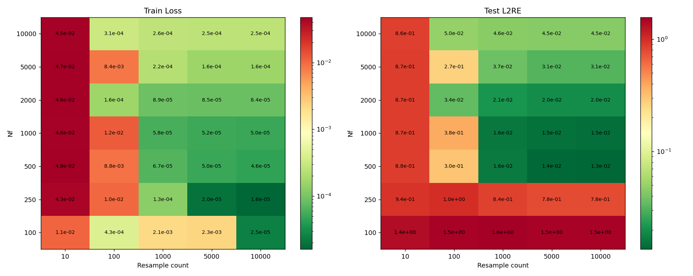

---

## Reviewer sQNm — Q2: Adam / AdamW comparison

> *"It seems like the paper largely does not consider Adam/AdamW when debating optimizers. How does it compare to the other methods mentioned?"*

---

**Figure 5. Adam and Adam + RoPINN Results on Convection Benchmarks**

*Two experiments quantifying Adam's position in the optimizer landscape. Panels (a)–(b) place Adam and SOAP side-by-side on a PINN benchmark, using matched hyperparameter grids to show where Adam achieves competitive training loss and test error and where it falls behind a quasi-second-order method. Panels (c)–(d) combine Adam with RoPINN on the convection equation with varying source terms; the heatmap format (matching Figure 1) shows whether residual reweighting recovers the well-trained regime for runs where plain Adam underfits or overfits.*

<table border="0" cellpadding="0" cellspacing="0" align="center" style="border-collapse: collapse;">
  <tr>
    <td align="center" style="padding: 10px; border: 0px;">
      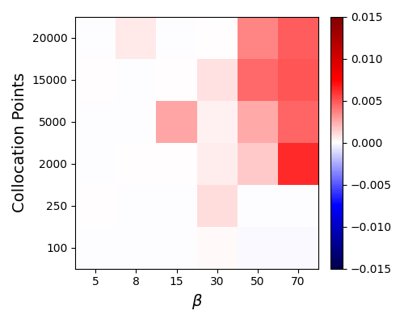
       
      <strong>(a) Adam vs SOAP Training Loss</strong>
    </td>
    <td align="center" style="padding: 10px; border: 0px;">
      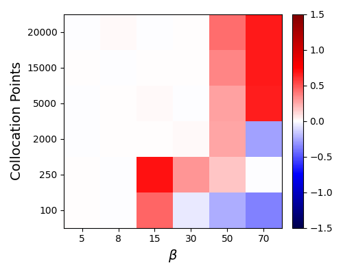
       
      <strong>(b) Adam vs SOAP Test Error</strong>
    </td>
  </tr>
  <tr>
    <td align="center" style="padding: 10px; border: 0px;">
      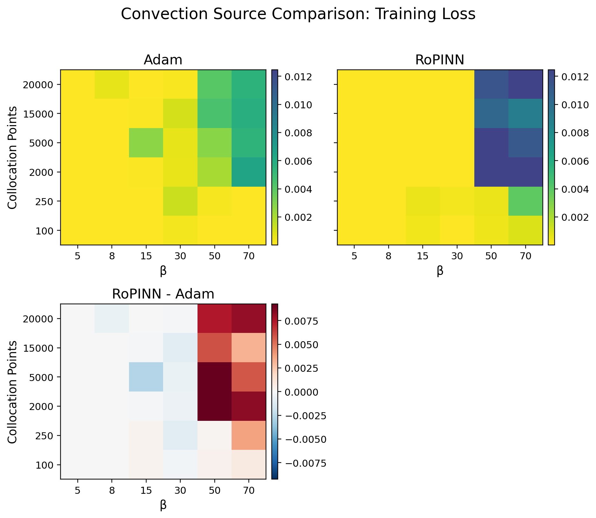
       
      <strong>(c) Adam + RoPINN Training Loss (Convection)</strong>
    </td>
    <td align="center" style="padding: 10px; border: 0px;">
      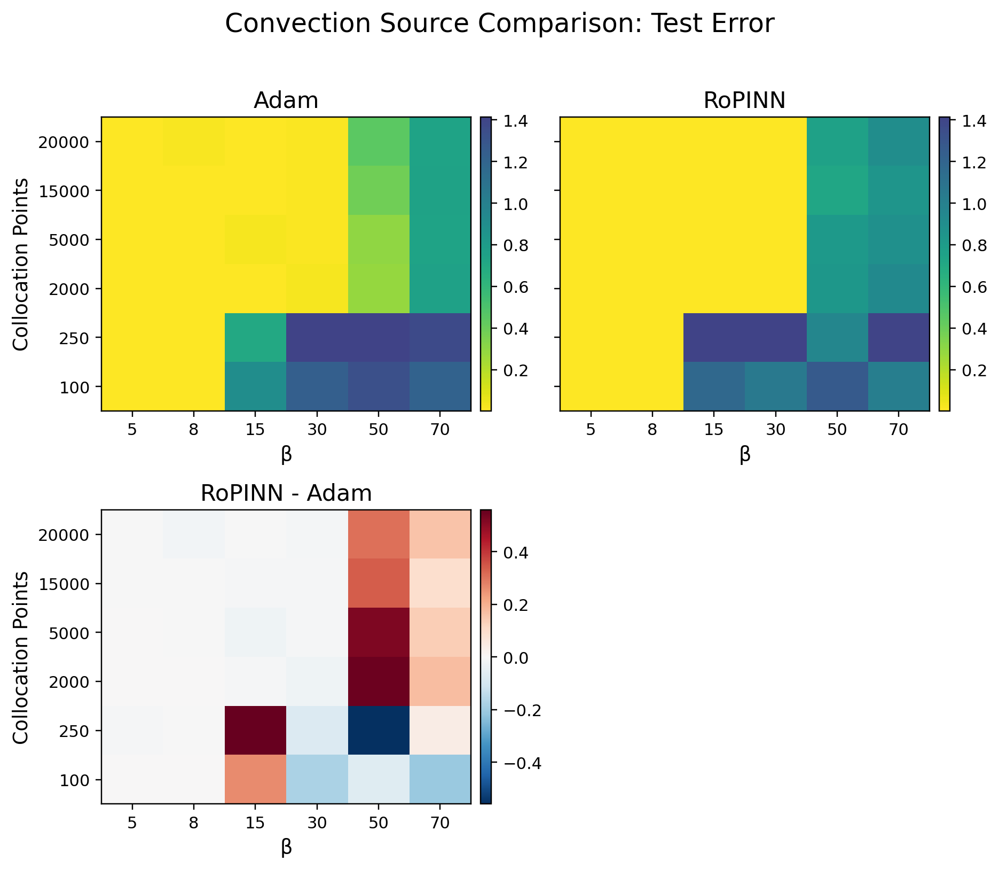
       
      <strong>(d) Adam + RoPINN Test Error (Convection)</strong>
    </td>
  </tr>
</table>

---

## Reviewer sQNm — Q3: SOAP as a quasi-second-order method

> *"How does SOAP fit into the quasi-second-order approach considered in the paper? It would be interesting to consider more methods that take into account curvature in the loss landscape."*

---

**Figure 6. SOAP, NNCG, and RoPINN Results on Convection Benchmarks**

*A three-way comparison of curvature-aware optimizers on the convection equation with varying source terms. SOAP (Shampoo-based quasi-second-order) approximates the full preconditioned gradient using Kronecker-factored curvature; NNCG applies a learned preconditioner via conjugate gradient; RoPINN reweights residuals to soften ill-conditioned directions in the loss landscape. The wider heatmaps span a larger hyperparameter grid, enabling direct visual comparison of how each method reshapes regime boundaries. Together, the panels situate SOAP relative to other curvature-aware strategies and show whether second-order preconditioning and residual reweighting provide complementary or redundant benefits.*

<table border="0" cellpadding="0" cellspacing="0" align="center" style="border-collapse: collapse;">
  <tr>
    <td align="center" style="padding: 10px; border: 0px;">
      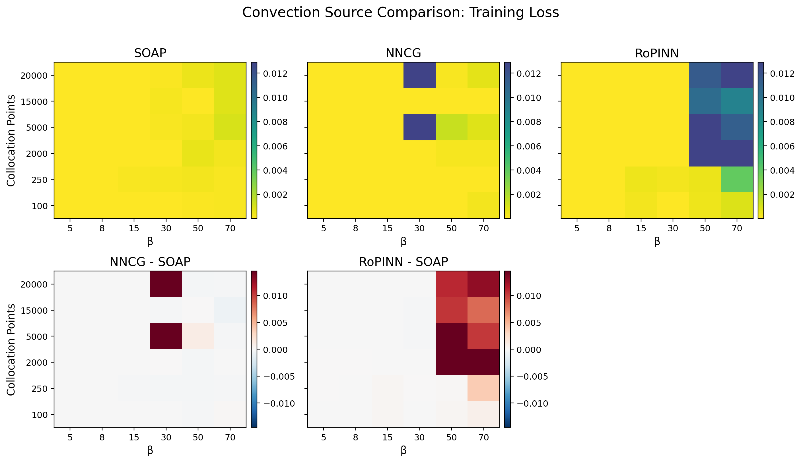
       
      <strong>(a) SOAP + NNCG + RoPINN Training Loss (Convection)</strong>
    </td>
    <td align="center" style="padding: 10px; border: 0px;">
      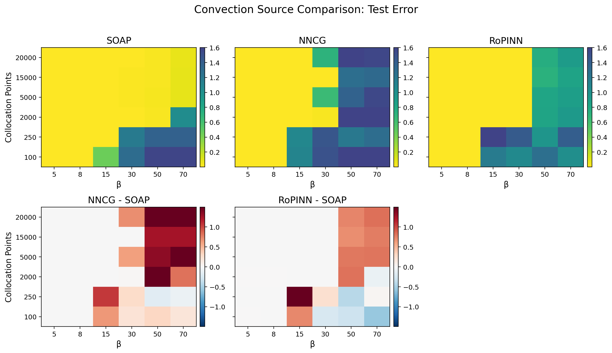
       
      <strong>(b) SOAP + NNCG + RoPINN Test Error (Convection)</strong>
    </td>
  </tr>
</table>

