

## Reviewer 9qHM (W2 / Q1)

Figure 1. Training loss and test error for Physics-informed NeuralODE with Adam, RoPINN, and NNCG optimizers.

  
  

<strong>(a) PI-NeuralODE with Adam</strong>

  
  

<strong>(b) PI-NeuralODE with RoPINN</strong>

  
  

<strong>(c) PI-NeuralODE with NNCG</strong>

  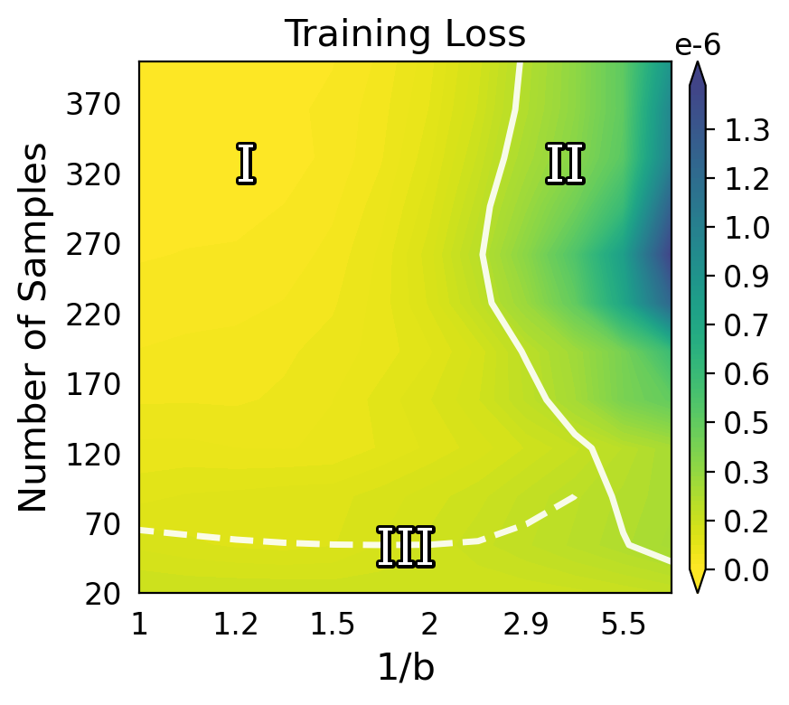
  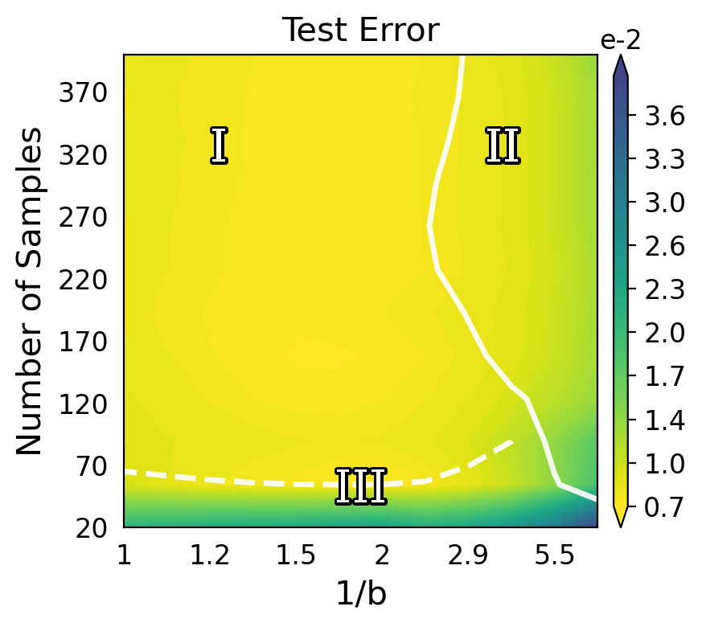

<strong>(d) NeuralODE with Adam</strong>

---

Figure 2. Training loss and test error for PINO with ALM, RoPINN, and Curriculum Learning (CL).

---

## Reviewer 9qHM (Q2, Q3) / Reviewer kKd9 (Q1)

Figure 3. Seed sensitivity of RoPINN over 3 seeds (std).

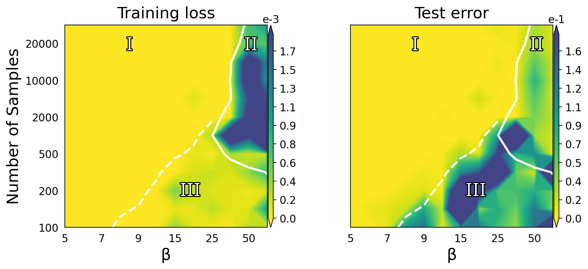

Figure 4. Failure rate of NNCG on reaction over 3 seeds.

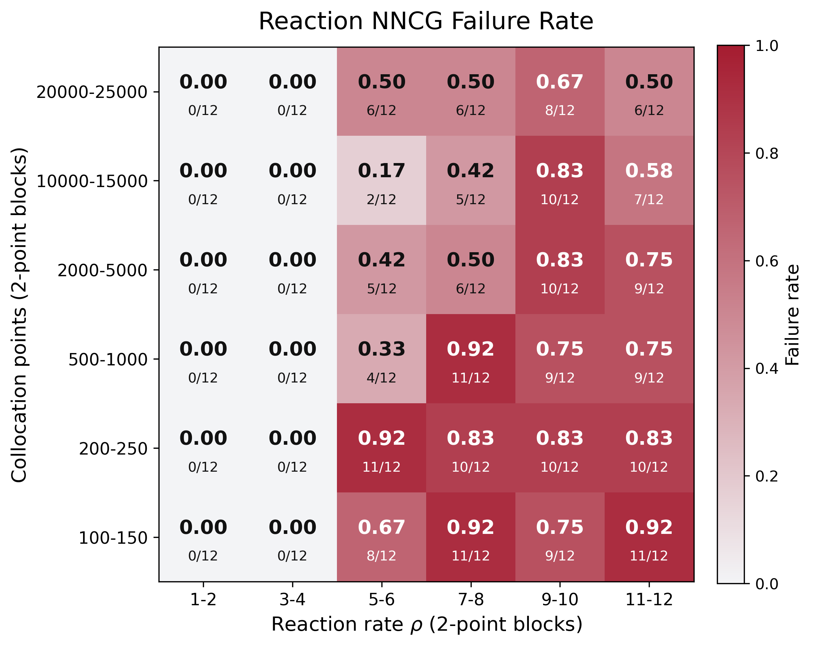

---

Figure 5. Boundary sensitivity analysis.

  
  

<strong>(a) Convection + ALM &emsp;&emsp;&emsp; (b) Convection + L-BFGS</strong>

  
  

<strong>(c) Convection + NNCG &emsp;&emsp;&emsp; (d) RoPINN</strong>

  
  

<strong>(e) Reaction + L-BFGS &emsp;&emsp;&emsp; (f) Wave + L-BFGS</strong>

  
  

<strong>(g) AD-FNO &emsp;&emsp;&emsp; (h) Poisson-FNO</strong>

---

## Reviewer sQNm (Q1)

Figure 6. Training loss and test error on convection system with resampling collocation points.

---

## Reviewer sQNm (Q2)

Figure 7. Comparison of Adam, RoPINN, NNCG, and SOAP on the Convection system.

  
  

<strong>(a) Training Loss (Adam - SOAP) &emsp;&emsp;&emsp; (b) Test Error (Adam - SOAP)</strong>

  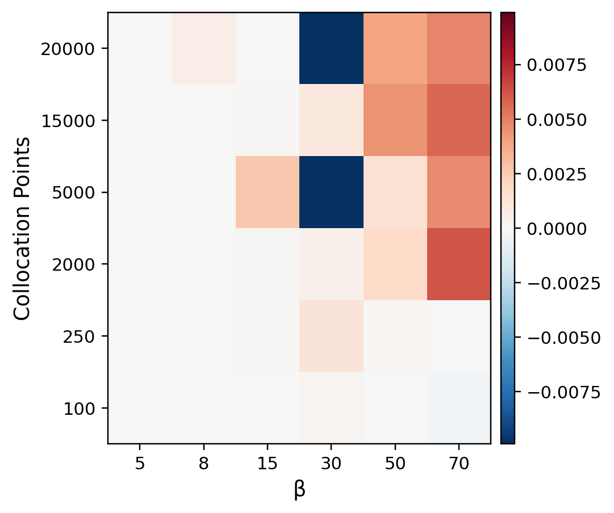
  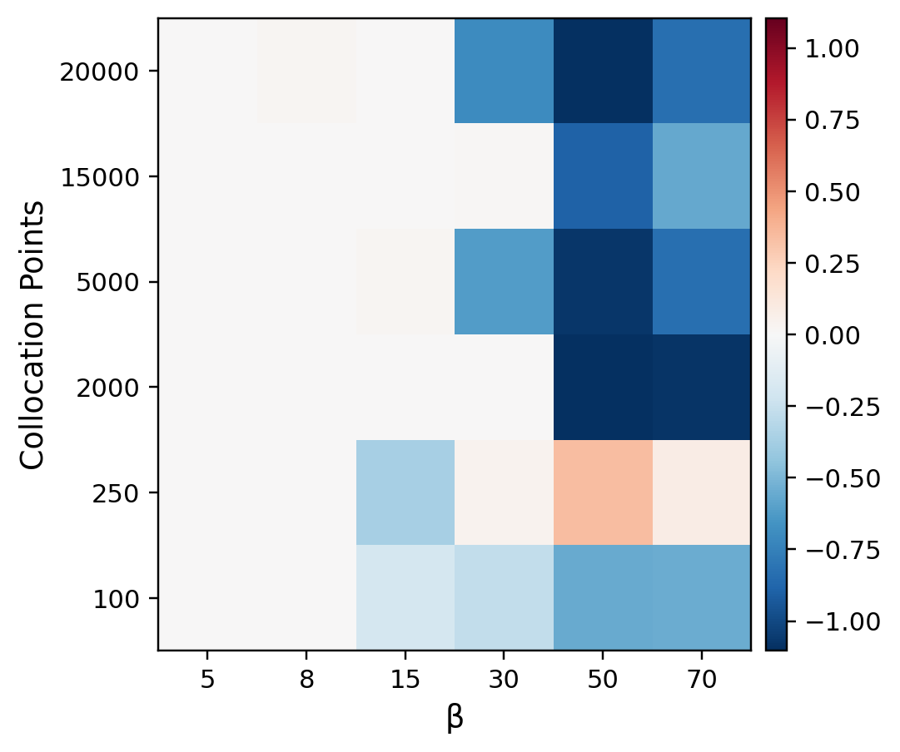

<strong>(c) Training Loss (Adam - NNCG) &emsp;&emsp;&emsp; (d) Test Error (Adam - NNCG)</strong>

  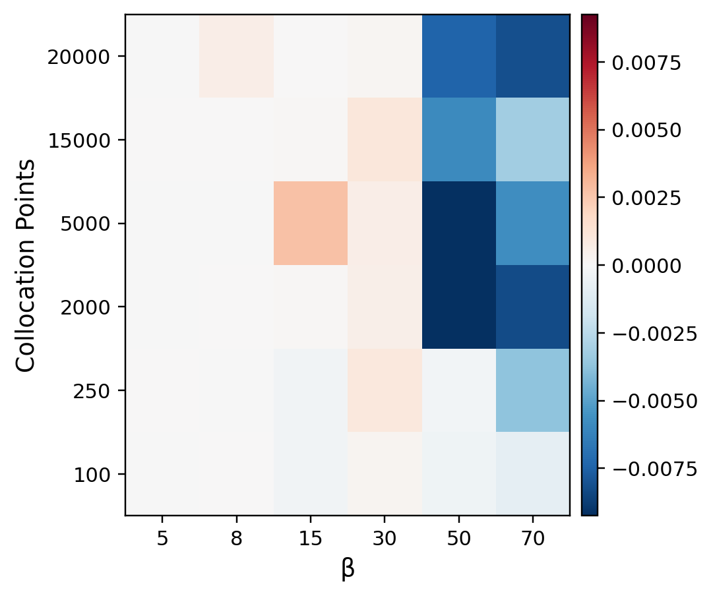
  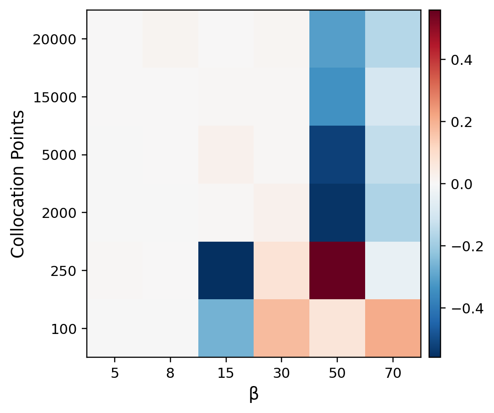

<strong>(e) Training Loss (Adam - RoPINN) &emsp;&emsp;&emsp; (f) Test Error (Adam - RoPINN)</strong>

---

## Reviewer sQNm (Q3)

Figure 8. Comparison of SOAP, NNCG, and RoPINN on the Convection system.

  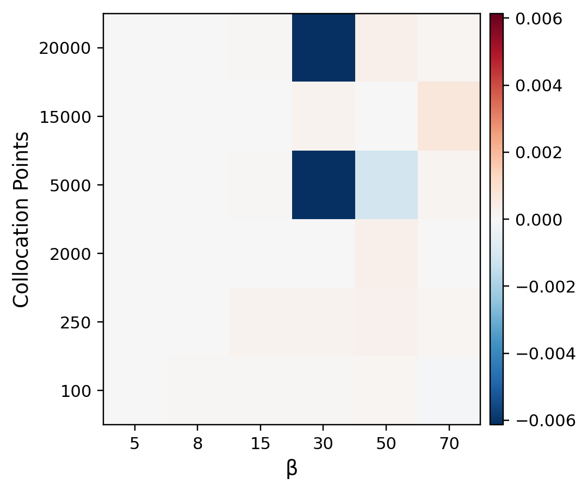
  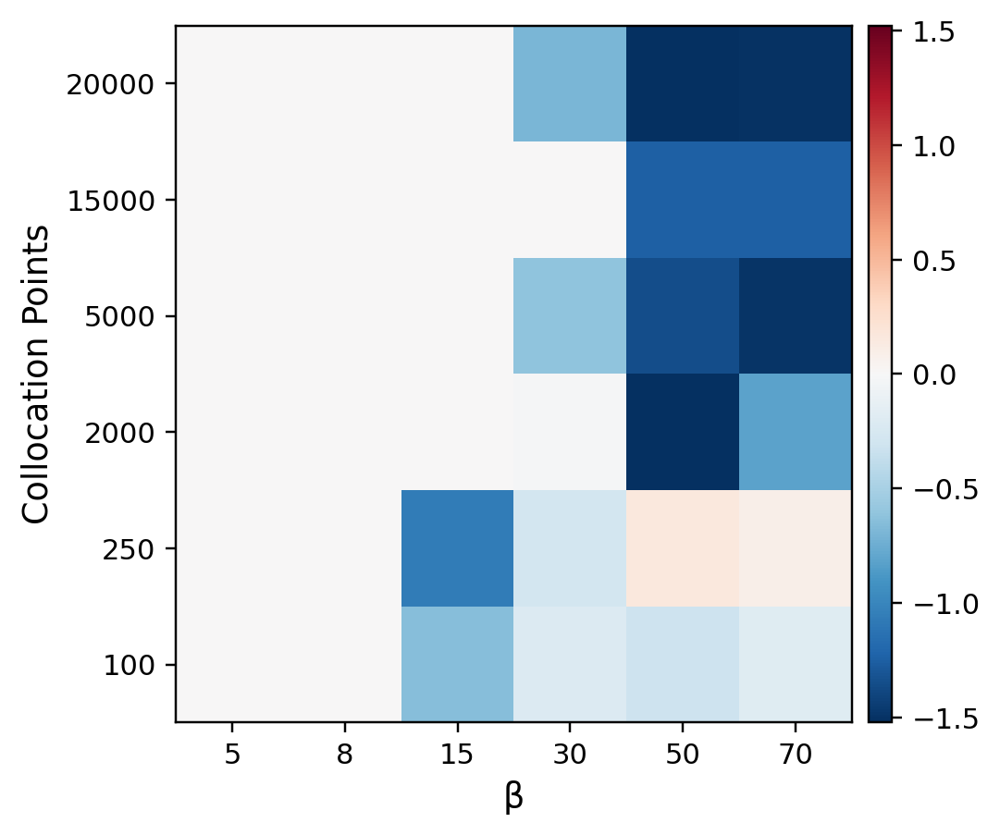

<strong>(a) Training Loss (SOAP - NNCG) &emsp;&emsp;&emsp; (b) Test Error (SOAP - NNCG)</strong>

  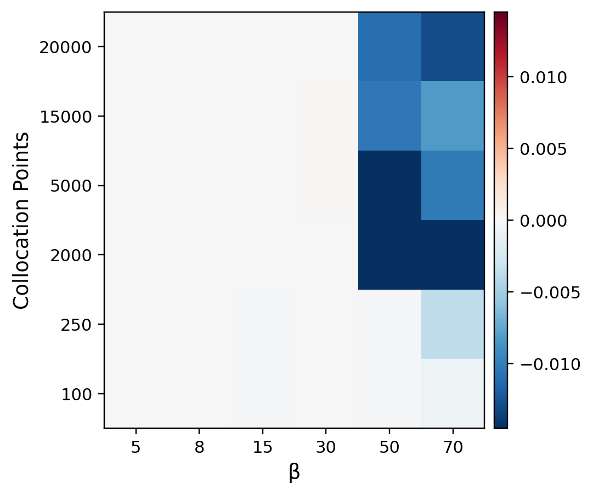
  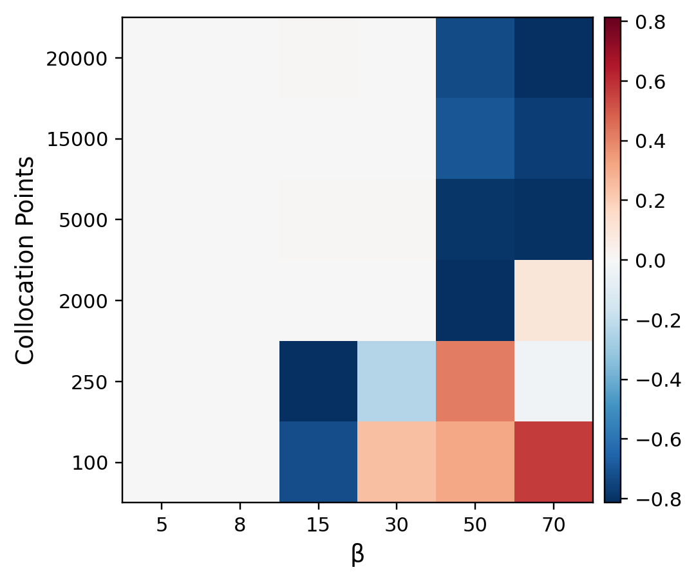

<strong>(c) Training Loss (SOAP - RoPINN) &emsp;&emsp;&emsp; (d) Test Error (SOAP - RoPINN)</strong>

